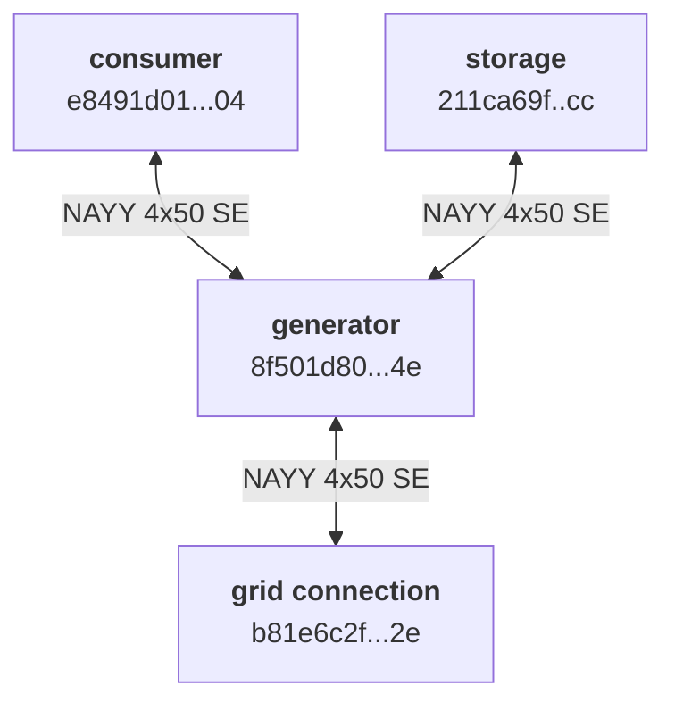

# Energy Use-Case Data Description

# Input: Scenario File

The structure and properties of the energy network is given by an `scenario.json` file.

A scenario consists of some metadata: it has a name, a description and version.
Further there can be different elements:
1. consumer
2. generator (which may consist of multiple producers)
3. storage

Those components are then connected to an energy network.

## Consumer

Every consumer entity must have a unique identifier `Identifier`. 
`Address`, `Category`, `Name`, `Level` are used for informational purposes only.

`Type` (`load`) is used during network generation.

`InService` enables/disables an entity.

Consumer is a load and must have a load profile.
The load data (historic or predictive) is given in `ProfileIdentifier`.

`Latitude` and `Longitude` are used to display the location on a map.


```json
{
    "Address": "RISC Strasse 1",
    "Category": "Household",
    "Identifier": "e8491d01-3a8b-4482-adf3-e0e7130aba04",
    "Latitude": 48.3789,
    "Level": 7,
    "Longitude": 14.5175,
    "Name": "Household 1",
    "ProfileIdentifier": "two_person_all_working_no_heat",
    "Type": "load",
    "InService": true
}
```

## Generator

Every generator entity must have a unique identifier `Identifier`. 
`Address`, `Category`, `Name`, `Level` are used for informational purposes only.

`Type` (`generator`) is used during network generation.

`InService` enables/disables an entity.

Generator is an energy source and must have a generation profile.
This is a non-programmable generator, i.e., it always generates the amount of energy as given in its profile.

The generation data (historic or predictive) is given in `ProfileIdentifier`.

`Latitude` and `Longitude` are used to display the location on a map.

```json
{
    "Name": "photovoltaic 1",
    "Identifier": "8f501d80-59ce-4706-875f-809b3902924e",
    "ProducerIdentifier": "49781510-112c-403f-97b1-ef3f1abec7b3",
    "Latitude": 48.3791,
    "Longitude": 14.5177,
    "Address": "Risc Strasse 2",
    "Level": 7,
    "Type": "generator",
    "Category": "household",
    "ProfileIdentifier": "hgb_south_10kwp",
    "InService": true
}
```

## Producer

A generator has a producer configuration that can be used to define a location-specific generator.
For which a model can be created and stored.
The model name is given in `ModelIdentifier`, which is then used in the energy network.
`ConfigurationEntries` is an array, therefore a generator can consists of multiple parts.


```json
{
    "Identifier": "49781510-112c-403f-97b1-ef3f1abec7b3",
    "Name": "Producer 1",
    "ModelIdentifier": "bad_zell_all_aspects.onnx",
    "ConfigurationEntries": {
        [
            "Latitude": 48.3791,
            "Longitude": 14.5177,
            "Peakpower": 10,
            "Angle": 22,
            "Aspect": 0,
            "Loss": 14
        ]
    }
}
```

## Storage

Every storage entity must have a unique identifier `Identifier`. 
`Address`, `Category`, `Name`, `Level` are used for informational purposes only.

`Latitude` and `Longitude` are used to display the location on a map.

`Type` (`storage`) is used during network generation.

`InService` enables/disables an entity.

`MinimumCapacity` and `MaximumCapacity` define the storage capacity.
In case no storage should be available, use `"InService": false` and do not set `"MaximumCapacity": 0`.

`StateOfCharge` is the state of charge for the current call.
The powerflow calculation is stateless, therefore it is necessary for the caller to update state.

```json
{
    "Name": "Storage 1",
    "Identifier": "211ca69f-2100-4a67-94da-26e1dbd40dcc",
    "Latitude": 48.3793,
    "Longitude": 14.5179,
    "Address": "none",
    "Level": 7,
    "Type": "storage",
    "Category": "household",
    "InService": true,
    "MinimumCapacity": 0,
    "MaximumCapacity": 0.01,
    "CapacityUnit": "MWh",
    "MinimumActivePower": 0,
    "MaximumActivePower": 1,
    "MinimumReactivePower": 0,
    "MaximumReactivePower": 1,
    "CurrentActivePower": 0,
    "StateOfCharge": 0
}
```

## Network

The network connects all entities.
Entities are connected to the network by buses. 
Those buses are then connected using lines.

The type in the buses must match the type of the entities.

`grid_connection` is a special bus, which is used as slack bus, i.e. in case there is not sufficient energy in the network it can be imported through the external grid.
If there is too much energy it can be exported to the grid.
For the `grid_connection` an entity must be created in order to be able to plot it on a map.

The `Lines` connect the buses.

The following snippet shows an example:

```json
"Network": {
    "Buses": [
        {
            "Identifier": "e8491d01-3a8b-4482-adf3-e0e7130aba04",
            "Voltage": 0.4,
            "Category": "consumer",
            "Type": "load"
        },
        {
            "Identifier": "b81e6c2f-6e93-40a7-980b-91bf97b22e2e",
            "Voltage": 0.4,
            "Category": "grid_connection",
            "Type": "grid_connection"
        },
        {
            "Identifier": "8f501d80-59ce-4706-875f-809b3902924e",
            "Voltage": 0.4,
            "Category": "generator",
            "Type": "generation"
        },
        {
            "Identifier": "211ca69f-2100-4a67-94da-26e1dbd40dcc",
            "Voltage": 0.4,
            "Category": "storage",
            "Type": "storage"
        }
    ],
    "Entities": [
        {
            "Address": "Risc Strasse 0",
            "Category": "network",
            "Identifier": "b81e6c2f-6e93-40a7-980b-91bf97b22e2e",
            "Latitude": 48.3787,
            "Longitude": 14.5173,
            "Name": "grid connection 1",
            "NetworkEntity": "network",
            "Type": "network"
        }
    ],
    "Lines": [
        {
            "FromBus": "b81e6c2f-6e93-40a7-980b-91bf97b22e2e",
            "ToBus": "e8491d01-3a8b-4482-adf3-e0e7130aba04",
            "StdType": "NAYY 4x50 SE",
            "LengthKm": 0.1
        },
        {
            "FromBus": "e8491d01-3a8b-4482-adf3-e0e7130aba04",
            "ToBus": "8f501d80-59ce-4706-875f-809b3902924e",
            "StdType": "NAYY 4x50 SE",
            "LengthKm": 0.1
        },
        {
            "FromBus": "8f501d80-59ce-4706-875f-809b3902924e",
            "ToBus": "211ca69f-2100-4a67-94da-26e1dbd40dcc",
            "StdType": "NAYY 4x50 SE",
            "LengthKm": 0.1
        }
    ]
}
```



# Complete Example

Entities (consumer, generator or storage) must be defined.
`Identifier` must be a unique identifier and is used to refer to the connections.

A complete sample:

```json
{
 
    "Scenario": {
        "Name": "1 Consumer, 1 Generator, rural",
        "Description": "simple test network",
        "Version": "2024-01-30-V1",
        "Consumers": [
            {
                "Address": "Risc Strasse 1",
                "Category": "household",
                "Identifier": "e8491d01-3a8b-4482-adf3-e0e7130aba04",
                "Latitude": 48.3789,
                "Level": 7,
                "Longitude": 14.5175,
                "Name": "Household 1",
                "ProfileIdentifier": "two_person_all_working_no_heat",
                "Type": "load",
                "InService": true
            }
        ],
        "Generators": [
            {
                "Name": "photovoltaic 1",
                "Identifier": "8f501d80-59ce-4706-875f-809b3902924e",
                "ProducerIdentifier": "49781510-112c-403f-97b1-ef3f1abec7b3",
                "Latitude": 48.3791,
                "Longitude": 14.5177,
                "Address": "Risc Strasse 2",
                "Level": 7,
                "Type": "generator",
                "Category": "household",
                "ProfileIdentifier": "hgb_south_10kwp",
                "InService": true
            }
        ],
        "Producer": [
            {
                "Identifier": "49781510-112c-403f-97b1-ef3f1abec7b3",
                "Name": "producer 1",
                "ModelIdentifier": "bad_zell_all_aspects.onnx",
                "ConfigurationEntries": {
                    [
                        "latitude": 48.3791,
                        "longitude": 14.5177,
                        "peakpower": 10,
                        "angle": 22,
                        "aspect": 0,
                        "loss": 14
					]
                }
            }
        ],
        "Storages": [
            {
                "Name": "Storage 1",
                "Identifier": "211ca69f-2100-4a67-94da-26e1dbd40dcc",
                "Latitude": 48.3793,
                "Longitude": 14.5179,
                "Address": "none",
                "Level": 7,
                "Type": "storage",
                "Category": "household",
                "InService": true,
                "MinimumCapacity": 0,
                "MaximumCapacity": 0.01,
                "CapacityUnit": "MWh",
                "MinimumActivePower": 0,
                "MaximumActivePower": 1,
                "MinimumReactivePower": 0,
                "MaximumReactivePower": 1,
                "CurrentActivePower": 0,
                "StateOfCharge": 0
            }
        ],
        "Network": {
            "Buses": [
                {
                    "Identifier": "e8491d01-3a8b-4482-adf3-e0e7130aba04",
                    "Voltage": 0.4,
                    "Category": "consumer",
                    "Type": "load"
                },
                {
                    "Identifier": "b81e6c2f-6e93-40a7-980b-91bf97b22e2e",
                    "Voltage": 0.4,
                    "Category": "grid_connection",
                    "Type": "grid_connection"
                },
                {
                    "Identifier": "8f501d80-59ce-4706-875f-809b3902924e",
                    "Voltage": 0.4,
                    "Category": "generator",
                    "Type": "generation"
                },
                {
                    "Identifier": "211ca69f-2100-4a67-94da-26e1dbd40dcc",
                    "Voltage": 0.4,
                    "Category": "storage",
                    "Type": "storage"
                }
            ],
            "Entities": [
                {
                    "Address": "Risc Strasse 0",
                    "Category": "network",
                    "Identifier": "b81e6c2f-6e93-40a7-980b-91bf97b22e2e",
                    "Latitude": 48.3787,
                    "Longitude": 14.5173,
                    "Name": "grid connection 1",
                    "NetworkEntity": "network",
                    "Type": "network"
                }
            ],
            "Lines": [
                {
                    "FromBus": "b81e6c2f-6e93-40a7-980b-91bf97b22e2e",
                    "ToBus": "e8491d01-3a8b-4482-adf3-e0e7130aba04",
                    "StdType": "NAYY 4x50 SE",
                    "LengthKm": 0.1
                },
                {
                    "FromBus": "e8491d01-3a8b-4482-adf3-e0e7130aba04",
                    "ToBus": "8f501d80-59ce-4706-875f-809b3902924e",
                    "StdType": "NAYY 4x50 SE",
                    "LengthKm": 0.1
                },
                {
                    "FromBus": "8f501d80-59ce-4706-875f-809b3902924e",
                    "ToBus": "211ca69f-2100-4a67-94da-26e1dbd40dcc",
                    "StdType": "NAYY 4x50 SE",
                    "LengthKm": 0.1
                }
            ]
        }
    }
}
```

# Usage

A scenario file with the according model files must be sent to the network node.
Then it can be queried using for different timestamps.
The state must be handled separately.
